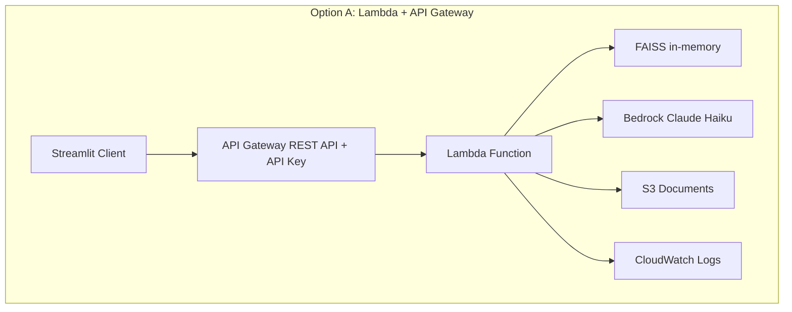
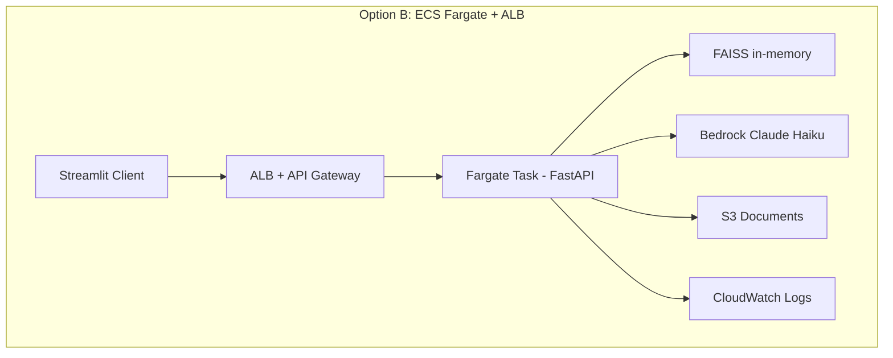
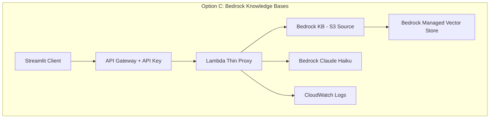
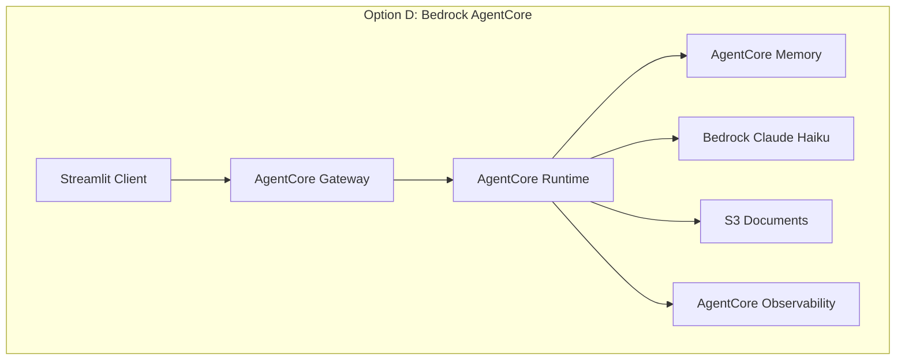
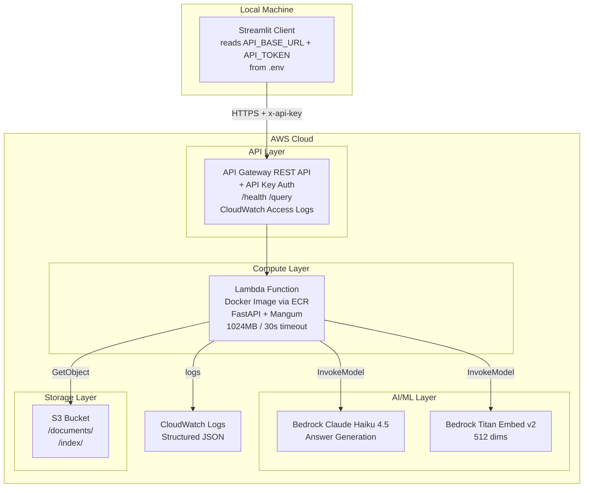

# Architecture Comparison & Decision Matrix

> [!NOTE]
> This document evaluates architecture alternatives for the AWS KB Agent submission, considering the $20 budget, 8-12 hour timeframe, evaluation rubric, and AWS Well-Architected Framework pillars.

## 1. Architecture Options Overview









## 2. Detailed Evaluation Matrix

### 2.1 Implementation Speed & Risk

| Criteria | A: Lambda+APIGW | B: ECS Fargate | C: Bedrock KB | D: AgentCore |
|----------|:---:|:---:|:---:|:---:|
| **Impl. hours (est.)** | 6-8h | 8-10h | 4-6h | 8-12h |
| **CDK complexity** | Medium | High | Low-Medium | High (new service) |
| **Number of subsystems** | 4 | 6 | 3 | 5 |
| **Cold start risk** | ⚠️ FAISS load ~5s | ✅ Always warm | ✅ Managed | ✅ Managed |
| **Deployment risk** | Low | Medium (Docker) | Low | High (new, less docs) |
| **Budget risk** | ✅ ~$1-3 | ⚠️ ~$5-15 | ⚠️ $5-10 (AOSS implied) | ❓ Unknown pricing |
| **CDK Python support** | ✅ Mature | ✅ Mature | ✅ Mature | ⚠️ Limited/New |

### 2.2 AWS Well-Architected Framework (5 Pillars)

| Pillar | A: Lambda+APIGW | B: ECS Fargate | C: Bedrock KB | D: AgentCore |
|--------|:---:|:---:|:---:|:---:|
| **Operational Excellence** | Good (serverless, low ops) | Good (container logs, health checks) | Best (fully managed) | Good (built-in observability) |
| **Security** | Good (IAM, API keys, no VPC needed) | Good (VPC, security groups, task roles) | Good (IAM, Bedrock policies) | Good (Cedar policies) |
| **Reliability** | Good (auto-retry, multi-AZ) | Good (task health checks, auto-restart) | Best (managed HA) | Good (microVM isolation) |
| **Performance** | ⚠️ Cold start concern with FAISS | ✅ Persistent, fast responses | ✅ Optimized retrieval | ✅ Fast cold start claimed |
| **Cost Optimization** | ✅ Best (pay per request) | ⚠️ Fargate minimum ~$0.5/hr | ⚠️ Bedrock KB may use AOSS | ❓ New pricing model |

### 2.3 Feature Implementation Difficulty

| Feature | A: Lambda | B: Fargate | C: Bedrock KB | D: AgentCore |
|---------|-----------|-----------|---------------|-------------|
| Document upload | S3 presigned URL | S3 upload route | S3 source sync | S3 + Gateway |
| Document parsing | In Lambda (size limit!) | In container | Managed by KB | Custom |
| Chunking | Custom (LangChain) | Custom (LangChain) | **Managed** ✅ | Custom |
| Embedding generation | Bedrock Titan v2 API | Bedrock Titan v2 API | **Managed** ✅ | Bedrock API |
| Vector search | FAISS in-memory | FAISS in-memory | **Managed** ✅ | Memory service |
| Answer generation | Bedrock invoke | Bedrock invoke | Bedrock invoke | Bedrock invoke |
| Source citations | Custom metadata | Custom metadata | **Managed** ✅ | Custom |
| Confidence scoring | Custom heuristic | Custom heuristic | Limited (scores returned) | Custom |
| **Streaming responses** | ❌ REST APIGW buffers; needs Function URL | ✅ HTTP/1.1 chunked + HTTP/2 native | ⚠️ Via invoke stream | ✅ Built-in |
| Session memory | DynamoDB | In-memory/DynamoDB | ❌ Not built-in | ✅ Memory service |

### 2.4 What's Out-of-Box, Easy, Needs Effort, or Requires Migration

| Capability | Out-of-box | Easy | Effort | Migration needed |
|-----------|:---:|:---:|:---:|:---:|
| **Option A: Lambda+APIGW** | API auth, CloudWatch, S3 | Health endpoint, structured logs | FAISS cold start optimization, confidence scoring | Streaming (need Function URL or WebSocket APIGW) |
| **Option B: ECS Fargate** | Health checks, persistent state, streaming | Docker build, logging | ALB + APIGW integration, task scaling | Multi-region (need ALB cross-region) |
| **Option C: Bedrock KB** | Chunking, embedding, retrieval, source citations | S3 sync, KB creation via CDK | Custom confidence scoring, custom prompts | Fine-grained retrieval control |
| **Option D: AgentCore** | Runtime, memory, observability, gateway | Tool registration, policy engine | Learning new service patterns | CDK constructs may not exist yet |

## 3. Evaluation Rubric Alignment

Based on the [project brief evaluation criteria](file:///c:/Users/daniv/Programacion/oversight/AWS%20Native%20Knowledge%20Base%20Agent%20Candidate%20Project%20Brief.md#L350-L368):

| Rubric Criterion | A: Lambda | B: Fargate | C: Bedrock KB | D: AgentCore |
|-----------------|:---:|:---:|:---:|:---:|
| **Architecture judgment** | ✅ Sensible, standard | ✅ Production-realistic | ⚠️ Too managed, less judgment shown | ⚠️ Impressive but risky |
| **Infrastructure quality** | ✅ Clean CDK, few resources | ⚠️ More complex CDK | ✅ Simple CDK | ⚠️ CDK support unclear |
| **API design** | ✅ Full control | ✅ Full control | ⚠️ Proxying Bedrock API | ✅ Via Gateway |
| **RAG design** | ✅ Full custom, can explain deeply | ✅ Same | ⚠️ Managed = less to explain | ✅ With Memory |
| **Production thinking** | ✅ Clear scaling path to Fargate | ✅ Already production-like | ✅ Managed = production by default | ✅ Enterprise features |
| **Code quality** | ✅ Minimal, readable | ⚠️ More boilerplate (Dockerfile, task def) | ✅ Minimal code | ⚠️ New patterns |
| **Communication** | ✅ Easy to explain tradeoffs | ✅ Easy to explain | ⚠️ Less to explain (managed) | ✅ Shows AWS depth |

## 4. Budget Analysis ($20 Limit)

| Service | A: Lambda | B: Fargate | C: Bedrock KB | Notes |
|---------|----------|-----------|---------------|-------|
| **API Gateway** | $0 (free tier) | $0 (free tier) | $0 (free tier) | 1M requests free |
| **Lambda** | $0 (free tier) | N/A | $0 (free tier) | 1M requests free |
| **ECS Fargate** | N/A | ~$0.50/hr × hours | N/A | 0.25 vCPU = $0.01/hr, 0.5GB = $0.005/hr. Running 10hrs = ~$0.15 minimum |
| **S3** | $0.01 | $0.01 | $0.01 | Tiny document set |
| **Bedrock Claude Haiku** | ~$0.50 (50 queries) | ~$0.50 | ~$0.50 | $0.25/M input, $1.25/M output tokens |
| **Bedrock Titan Embed** | ~$0.10 | ~$0.10 | Included in KB | $0.10/M tokens |
| **Bedrock Knowledge Base** | N/A | N/A | ⚠️ **$0** if no AOSS | KB service itself is free, but AOSS is not |
| **CloudWatch** | $0 (free tier) | $0 (free tier) | $0 (free tier) | 5GB ingestion free |
| **TOTAL ESTIMATE** | **$0.50-2** | **$1-5** | **$1-3** (no AOSS) | |


> [!CAUTION]
> **Bedrock Knowledge Bases typically require Amazon OpenSearch Serverless (AOSS)** as the vector store, which has a **minimum charge of ~$0.24/OCU/hr × 2 OCUs = $0.48/hr**. Running for even 24 hours = $11.52. This can BUST the budget. However, Bedrock KB now supports other vector stores — need to verify if FAISS or Pinecone integration avoids AOSS.
>
> **Safest budget option: Option A (Lambda) or Option B (Fargate)** with self-managed FAISS.

## 5. Authentication Tradeoffs

### 5.1 Options Compared

| Question | API Gateway API Key | Lambda Authorizer | Cognito/JWT |
|----------|:---:|:---:|:---:|
| How is the token created? | Auto-generated in APIGW console/CDK | Custom token stored in Secrets Manager | User pool → sign-up/sign-in flow |
| Where is it stored? | API Gateway Usage Plan | Secrets Manager or SSM | Cognito User Pool |
| How does Streamlit pass it? | `x-api-key` header | `Authorization: Bearer <token>` header | `Authorization: Bearer <jwt>` header |
| How are unauthorized calls rejected? | APIGW returns 403 automatically | Lambda returns 401/403 | APIGW+Cognito returns 401 |
| Production improvement path | → Cognito or IAM auth | → Cognito or federated IdP | Already production-grade |
| **Implementation time** | **15 min** | **1-2 hours** | **2-4 hours** |
| **CDK complexity** | Low (3 constructs) | Medium (Lambda + layer) | High (User Pool + App Client + Authorizer) |
| **Demo friendliness** | ✅ Simple env var | ✅ Simple env var | ⚠️ Requires sign-up flow |

> [!TIP]
> **Recommendation**: Start with **API Gateway API Key** for the demo submission. Document the clear upgrade path to Cognito for production. This maximizes rubric score on "practical security decisions" while staying within time budget.

### 5.2 Why REST API, Not HTTP API v2

HTTP API v2 is ~70% cheaper per request (~$1/M vs ~$3.50/M) and adds ~10ms less overhead vs ~50ms for REST API. This is because HTTP API was a complete rewrite that discards the legacy VTL transformation engine — it simply pipes raw HTTP to Lambda.

**However**, HTTP API deliberately excluded static API Keys and Usage Plans. AWS considers them legacy security (static string `xyz123`) compared to rotating JWT tokens via Cognito. HTTP API expects JWT-based authorizers. For our demo we need the simplicity of an API Key, which is why REST API is the right choice. The upgrade path is: swap `api_key_required=True` for a `CognitoUserPoolsAuthorizer`, move to HTTP API v2 for cost savings.

### 5.3 AWS CLI/CDK Authentication

**Question**: *"You have console sign-in URL, username, and console password. Is this enough?"*

**Answer**: **No, not directly.** Console credentials ≠ programmatic access.

You need either:
1. **Access Key + Secret Key**: Generated from IAM console → Security Credentials. Set via `aws configure` or env vars (`AWS_ACCESS_KEY_ID`, `AWS_SECRET_ACCESS_KEY`)
2. **SSO/Identity Center**: If the sandbox uses AWS SSO, you'd use `aws sso login`

**Most likely flow**:
1. Sign into AWS Console with provided credentials
2. Go to IAM → Your User → Security Credentials
3. Create Access Key (choose "Command Line Interface")
4. Run `aws configure` locally with those keys
5. CDK will use the same credentials automatically

## 6. Fargate Containers + Vector DB Statelessness

**Question**: *"Do Fargate containers need the vector DB to be external due to statelessness?"*

**Answer**: **It depends on the Fargate configuration.**

- **Fargate tasks ARE ephemeral** — container storage is lost when the task stops/restarts
- **BUT** Fargate tasks can run for hours/days with `desiredCount=1` and health checks
- **For our demo**: Loading FAISS from S3 at startup is perfectly fine:
  1. Task starts → loads FAISS index from S3 (~100KB for small doc set) → serves queries
  2. If task restarts, it reloads from S3 (cold start ~2-5 seconds)
  3. This is the **recommended approach** from the project brief

- **For production**: You'd want an external vector DB (Pinecone, pgvector, etc.) to avoid cold-start latency and enable horizontal scaling
- **For our submission**: In-memory FAISS loaded from S3 is **perfectly acceptable** and explicitly recommended

## 8. Streaming Paths (Response Streaming)

Lambda + REST API Gateway **cannot stream**. API Gateway waits for Lambda to finish, buffers the complete response, then sends it. Options if streaming is needed:

| Path | Auth Story | HTTP Protocol | Effort vs Current |
|------|:---:|:---:|:---:|
| **Lambda + Function URL** | IAM SigV4 or no auth (public URL) | HTTP/1.1 chunked | Very easy (one CDK line) |
| **Lambda + Function URL + CloudFront** | CloudFront WAF / signed cookies | HTTP/1.1 chunked | Medium (2 extra constructs) |
| **Fargate + ALB** | ALB listener rules, any auth | HTTP/1.1 + HTTP/2 | High (Docker, task def, ALB) |
| **WebSocket API Gateway + Lambda** | Cognito or custom | Bidirectional push | High (completely different model) |

**Chosen**: No streaming for this submission (marked "Won't Have"). Fargate is the documented production upgrade path if streaming ever matters.

**HTTP/1.1 vs HTTP/2**: HTTP/1.1 handles one request/response per connection at a time and can stream via chunked transfer encoding. HTTP/2 multiplexes multiple streams over one connection and was built for streaming-first. Fargate + ALB supports both natively. Lambda REST API uses HTTP/1.1 but API Gateway buffers the body, so chunked encoding never reaches the client.

## 9. Embedding Service Choice

**Decision: Amazon Bedrock Titan Embeddings v2** (confirmed, locked in):

| Provider | Model | Dimensions | Cost | AWS Native? |
|----------|-------|-----------|------|:-----------:|
| **Amazon Bedrock Titan Embeddings v2** | `amazon.titan-embed-text-v2:0` | 256/512/1024 | $0.02/M tokens | ✅ Yes |
| **Amazon Bedrock Cohere Embed** | `cohere.embed-english-v3` | 1024 | $0.10/M tokens | ✅ Via Bedrock |
| **Google Gemini Embedding** | `models/embedding-001` | 768 | Free tier generous | ❌ External |
| **OpenAI ada-002** | `text-embedding-ada-002` | 1536 | $0.10/M tokens | ❌ External |

Rationale:
1. AWS-native — all data stays within AWS perimeter (security rubric win)
2. Cheapest ($0.02/M tokens)
3. Variable output dimensions: use **512** (sweet spot quality/cost/FAISS index size)
4. Consistent provider story: Bedrock for both embeddings AND generation

```python
# Bedrock Titan Embed v2 invocation:
body = json.dumps({"inputText": text, "dimensions": 512, "normalize": True})
response = bedrock.invoke_model(modelId="amazon.titan-embed-text-v2:0", body=body)
embedding = json.loads(response["body"].read())["embedding"]
```

## 10. Final Recommendation

### 🏆 Option A: Lambda + API Gateway (Chosen)



**Why Option A wins:**

1. **Budget**: ~$1-2 total. No ongoing costs when not in use
2. **Speed**: 6-8 hours implementation. Clean, minimal CDK
3. **Rubric optimization**: Maximum explanation surface area — every component is a deliberate choice you can discuss
4. **Clear production path**: "Lambda for demo, move to Fargate when cold starts matter" is the exact production thinking they want
5. **CDK**: Well-documented Python constructs for all services, two-stack design (stateful storage + stateless compute/API)

**When to switch to Option B (Fargate)**: If Lambda cold starts with FAISS exceed 10s, streaming is required, or package size exceeds 250MB limit.
