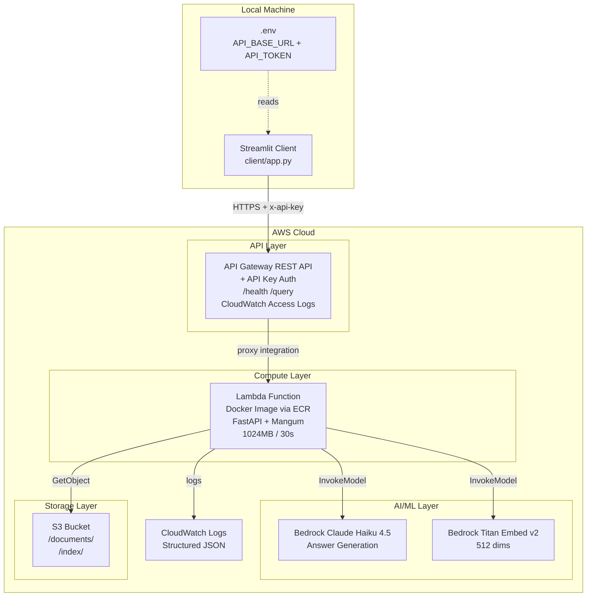

# Implementation Guide: AWS KB Agent

> [!NOTE]
> This document is the technical blueprint. The project lives in `oversight/` (monorepo). All paths are relative to that root.

## 1. Actual Project Structure (As Implemented)

```text
oversight/                             # uv monorepo root
├── app.py                             # CDK App entrypoint — two stacks
├── constants.py                       # Shared synthesis-time constants
├── pyproject.toml                     # uv config, [project.scripts]
├── uv.lock                            # Committed — reproducible installs
├── cdk.json                           # CDK CLI config → "app": "uv run python app.py"
│
├── src/
│   └── rag/                           # Business domain: RAG Knowledge Base
│       ├── component.py               # RagComponent(Construct) — wires Compute + API
│       ├── api/
│       │   └── infrastructure.py      # ApiConstruct — API Gateway REST API + auth
│       ├── storage/
│       │   └── infrastructure.py      # StorageConstruct — S3 bucket
│       ├── ingestion/                 # Offline FAISS Index Generation
│       │   └── seed.py                # Build local FAISS index via Bedrock
│       └── rag/
│           ├── infrastructure.py      # ComputeConstruct — Docker Lambda
│           └── runtime/               # Lambda code (Docker build context)
│               ├── main.py            # FastAPI app + Mangum handler
│               ├── Dockerfile         # Lambda image (x86_64, Amazon Linux 2023)
│               ├── requirements.txt   # Lambda-specific deps
│               ├── api/
│               │   ├── routes.py      # /health + /query endpoints
│               │   └── models.py      # Pydantic request/response models
│               ├── services/          # RAG business logic (no infra coupling)
│               │   ├── embedder.py    # Bedrock Titan Embed v2 + FAISS S3 ETag-cache
│               │   ├── retriever.py   # Hybrid FAISS + keyword retrieval
│               │   ├── generator.py   # Bedrock Claude Haiku invocation
│               │   └── logger.py      # Structured JSON CloudWatch logging
│               └── config.py          # pydantic-settings for env vars
│
├── scripts/
│   ├── input/                         # Source documents (PDF, DOCX, TXT)
│   ├── output/                        # Test API JSON responses
│   └── test_api.py                    # API smoke tests (health, query, auth)
│
└── docs/                              # Project documentation and knowledge base
```

### Key Structural Decisions

**Why `app.py` at the root (not `infra/app.py`)?**
The CDK cheatsheet recommended keeping the CDK entrypoint at the root alongside `constants.py` — simpler import paths and clearer that the whole repo is one CDK application. `cdk.json` `"app"` key points to it: `"uv run python app.py"`.

**Why domain-per-folder with co-located `infrastructure.py`?**
Each folder (`src/rag/api/`, `src/rag/storage/`, `src/rag/rag/`) contains both the CDK Construct (`infrastructure.py`) and the runtime code it manages. This follows the AWS-recommended project structure: infra is co-located with the code it deploys, not isolated in a separate `infra/` directory.

**Why `services/` not `rag/` inside the Lambda runtime?**
`services/` is business logic (embedding, retrieval, generation) that happens to implement RAG. It's more generic and aligns with clean architecture terminology. Both names are fine; `services/` is the one used.

---

## 2. CDK Stack Design (Stateful/Stateless Split)

```
App
├── KBAgentStackStorage  (termination_protection=True)
│   └── StorageConstruct
│       └── S3 Bucket
│
└── KBAgentStack
    └── RagComponent(Construct)
        ├── ComputeConstruct
        │   └── DockerImageFunction (Lambda)
        └── ApiConstruct
            ├── RestApi
            ├── LogGroup (access logs)
            ├── ApiKey
            └── UsagePlan
```

**Why two stacks?** S3 is stateful — renaming its CDK construct ID would change the CloudFormation logical ID, triggering bucket deletion and recreation (data loss). Keeping it in a separate stack with termination protection means `cdk destroy` refuses to delete it accidentally. All Lambda and API Gateway resources are stateless — safe to rename, redeploy, or destroy freely.

**Stack dependency**: `KBAgentStack` receives `KBAgentStorageStack.storage.bucket` as a Python object reference (not a CloudFormation cross-stack export). This avoids the complexity of `Fn.import_value()` while still logically separating the stacks.

**Deployment order**: CDK infers the dependency and deploys `KBAgentStackStorage` before `KBAgentStack` automatically.

---

## 3. System Architecture



---

## 4. Docker Lambda: Packaging Decision

**Why Docker Lambda instead of zip + Layer?**

| Concern | Zip + Layer | Docker Lambda |
|---------|:-----------:|:-------------:|
| **faiss-cpu must match Lambda OS** | ⚠️ Must build on Amazon Linux 2023 | ✅ Dockerfile controls OS |
| **Size limit** | 250MB unzipped | ✅ 10GB image |
| **Build reproducibility** | ⚠️ Layer build is fiddly on Windows | ✅ Dockerfile is deterministic |
| **Iteration speed** | Slow (rebuild layer) | Fast (Docker layer cache) |
| **Production realism** | OK | ✅ ECS Fargate upgrade path is trivial |

**Architecture decision: x86_64**

| | x86_64 | arm64 (Graviton2) |
|--|:------:|:-----------------:|
| Cost | baseline | ~20% cheaper |
| faiss-cpu on Lambda | ✅ Well tested | ⚠️ Needs arm64 wheel |
| Build on Windows | ✅ Easy | ⚠️ Cross-compile needed |
| CDK setting | `Platform.LINUX_AMD64` | `Platform.LINUX_ARM64` |

**Decision: `x86_64`** — safety > 20% cost saving for an 8-hour project. ARM is a documented future optimisation.

```dockerfile
# src/rag/rag/runtime/Dockerfile
# ==============================================================================
# STAGE 1: THE BUILDER
# ==============================================================================
FROM public.ecr.aws/lambda/python:3.12-x86_64 AS builder

COPY --from=ghcr.io/astral-sh/uv:latest /uv /uvx /bin/
ENV UV_COMPILE_BYTECODE=1
ENV UV_NO_PROGRESS=1

WORKDIR /build

# Cache Layer 1: Third-Party Dependencies Only
RUN --mount=type=cache,target=/root/.cache/uv \
    --mount=type=bind,source=uv.lock,target=uv.lock \
    --mount=type=bind,source=pyproject.toml,target=pyproject.toml \
    uv sync --locked --no-install-project --no-editable

# Cache Layer 2: Project Code & Installation
COPY . /build
RUN --mount=type=cache,target=/root/.cache/uv \
    uv sync --locked --no-editable

# ==============================================================================
# STAGE 2: FINAL RUNTIME
# ==============================================================================
FROM public.ecr.aws/lambda/python:3.12-x86_64

COPY --from=builder /build/.venv/lib/python3.12/site-packages ${LAMBDA_TASK_ROOT}/
COPY src/rag/rag/runtime/ ${LAMBDA_TASK_ROOT}/

CMD ["main.handler"]
```

**Native BuildKit Cache Overlays & Dependency Separation**
Instead of a flat `requirements.txt` build, we utilize a two-stage process using `uv sync` natively with the `uv.lock`. The first `RUN` command uses non-destructive bind mounts (`--mount=type=bind`) to read the lockfile without permanently burning it into the layer. It also uses `--no-install-project` to separate the slow-moving 3rd-party dependencies from lightning-fast application code cycles, ensuring rapid iteration without cache invalidations.

---

## 5. Why Mangum?

**Mangum** is an ASGI adapter: it translates API Gateway Lambda proxy events into standard ASGI requests that FastAPI can process.

```python
# src/rag/rag/runtime/main.py
from fastapi import FastAPI
from mangum import Mangum
from api.routes import router

app = FastAPI(title="KB Agent API", docs_url=None)
app.include_router(router)

handler = Mangum(app, lifespan="off")
```

**Benefits of Mangum + FastAPI over raw Lambda handler:**

| Feature | Raw Lambda dict handler | FastAPI + Mangum |
|---------|:-----------------------:|:----------------:|
| Auto OpenAPI docs | ❌ Manual | ✅ `/docs` auto-generated |
| Request validation | ❌ Manual | ✅ Pydantic models |
| Error responses | ❌ Manual dict | ✅ HTTPException auto-formatted |
| Run locally (dev) | ❌ Needs SAM/LocalStack | ✅ `uvicorn main:app --reload` |
| Upgrade to Fargate | ❌ Rewrite | ✅ Same code, just `uvicorn main:app` |
| Testing | ❌ Mock events | ✅ `TestClient(app)` |

The OpenAPI schema at `/docs` is a bonus — it's self-documenting and looks professional in a demo.

---

## 6. Subsystem Breakdown

### Subsystem 1: StorageConstruct (`src/rag/storage/infrastructure.py`)

**Goal**: S3 bucket exists, sample docs + FAISS index uploaded.

```python
class StorageConstruct(Construct):
    def __init__(self, scope, construct_id, **kwargs):
        super().__init__(scope, construct_id, **kwargs)
        self.bucket = s3.Bucket(
            self, "KBAgentBucket",
            removal_policy=RemovalPolicy.DESTROY,
            auto_delete_objects=True,   # CDK custom resource empties bucket on destroy
            block_public_access=s3.BlockPublicAccess.BLOCK_ALL,
            enforce_ssl=True,           # deny HTTP-only requests
        )
        CfnOutput(self, "BucketName", value=self.bucket.bucket_name,
                  export_name="KBAgent-BucketName")
```

> [!NOTE]
> `auto_delete_objects=True` deploys a CDK-managed Lambda custom resource that empties the bucket before CloudFormation deletes it. Without it, S3 refuses to delete a non-empty bucket and `cdk destroy` fails, leaving the bucket as an orphaned resource incurring ongoing cost.

---

### Subsystem 2: ComputeConstruct (`src/rag/rag/infrastructure.py`)

**Goal**: Docker Lambda that loads FAISS from S3 (ETag-cached), embeds queries via Bedrock, retrieves chunks, generates answer via Claude Haiku.

Key IAM notes:
- `bucket.grant_read(self.fn)` — L2 helper; emits scoped `GetObject/ListBucket` policy
- `add_to_role_policy` for Bedrock — no L2 grant helper exists in stable CDK; manual ARN construction is the correct, least-privilege approach
- `Stack.of(self).account` — resolves to `{ Ref: AWS::AccountId }` in CloudFormation; scopes the inference profile ARN to this account without using wildcards

**FAISS Load with ETag Write-Through Cache** — `src/rag/rag/runtime/services/embedder.py`:

```python
import os, json, pickle, boto3, faiss

s3 = boto3.client("s3")
BUCKET = os.environ["S3_BUCKET_NAME"]
INDEX_KEY = "index/index.faiss"
PKL_KEY = "index/index.pkl"

_index = None
_chunks = None
_etag = None

def _load_or_refresh():
    global _index, _chunks, _etag
    meta = s3.head_object(Bucket=BUCKET, Key=INDEX_KEY)
    latest_etag = meta["ETag"]
    if latest_etag == _etag and _index is not None:
        return  # warm hit — skip S3 download
    s3.download_file(BUCKET, INDEX_KEY, "/tmp/index.faiss")
    s3.download_file(BUCKET, PKL_KEY, "/tmp/index.pkl")
    _index = faiss.read_index("/tmp/index.faiss")
    with open("/tmp/index.pkl", "rb") as f:
        _chunks = pickle.load(f)
    _etag = latest_etag
```

**Mathematical Equivalence of Similarity Scoring**

The original LangChain prototype used `faiss.IndexFlatL2` (Euclidean distance) and converted the distance to a similarity score using `1.0 - (distance / 2.0)`. Our implementation uses `faiss.IndexFlatIP` (Inner Product) on `L2-normalized` vectors generated by Bedrock. These two approaches are mathematically identical.

*Proof:*
Let $u, v$ be L2-normalized embedding vectors ($\|u\|_2 = 1$, $\|v\|_2 = 1$).
FAISS `IndexFlatL2` computes the squared Euclidean distance:
$d^2(u,v) = \|u - v\|_2^2 = \langle u - v, u - v \rangle = \|u\|_2^2 + \|v\|_2^2 - 2\langle u, v \rangle = 2 - 2\langle u, v \rangle$

The prototype's similarity formula was $1 - \frac{d^2(u,v)}{2}$. Substituting the distance:
$\text{Similarity} = 1 - \frac{2 - 2\langle u, v \rangle}{2} = 1 - (1 - \langle u, v \rangle) = \langle u, v \rangle$

FAISS `IndexFlatIP` computes the Inner Product directly ($\langle u, v \rangle$), which is identical to the prototype's mathematically transformed L2 distance score, completely avoiding the extra arithmetic overhead while remaining highly accurate for similarity comparisons.

**Latency Impact & Rationale**

Does this translate to a meaningful latency improvement? **At our prototype scale, no—it is essentially architectural syntax sugar.**
FAISS is highly optimized C++ utilizing CPU SIMD instructions (like AVX2). For a small knowledge base (e.g., < 10,000 chunks), a vector search takes less than `0.001` seconds (1 millisecond) regardless of whether you use `IndexFlatIP` (dot product) or `IndexFlatL2` (Euclidean distance). The Python-level arithmetic we avoided (`1 - (distance / 2)`) also executes in fractions of a millisecond.

The real rationale for this choice is **correctness and maintainability**:
1. **Less Bug-Prone**: Manually converting distance to similarity is a common source of logic bugs (e.g., forgetting to normalize vectors, or dividing by the wrong constant). `IndexFlatIP` directly outputs the exact `[0, 1]` similarity score we need.
2. **Standardization**: Dot product (Inner Product) on normalized vectors is the industry standard for cosine similarity. 

---

### Subsystem 3: ApiConstruct (`src/rag/api/infrastructure.py`)

**Goal**: API Gateway REST API with API Key auth, CloudWatch access logs, proxied to Lambda.

Key decisions:
- REST API (not HTTP API v2): HTTP API v2 doesn't support native API Keys — it expects JWT authorizers. For this demo, REST API + API Key is simpler and sufficient. Upgrade path: swap to HTTP API v2 + Cognito JWT.
- CloudWatch access logs: one structured JSON line per APIGW request. Required by the brief (§8: "logging resources"). Distinct from Lambda execution logs.
- Stage `prod`: mandatory deployment target; makes the URL predictable (`…/prod/health`).
- Throttle: 10 RPS / 20 burst via both Stage settings and UsagePlan (belt-and-suspenders).

---

### Subsystem 4: RagComponent (`src/rag/component.py`)

**Goal**: Wire the stateless constructs (Compute + API) in dependency order. Accept `bucket` as a parameter from the parent stack.

```python
class RagComponent(Construct):
    def __init__(self, scope, construct_id, *, bucket, **kwargs):
        super().__init__(scope, construct_id, **kwargs)
        self.compute = ComputeConstruct(self, "Compute", bucket=bucket)
        self.api = ApiConstruct(self, "Api", handler=self.compute.fn)
```

---

### Subsystem 5: CDK App Entrypoint (`app.py`)

Two stacks. Tags applied to both via a shared `common_tags` dict.

```python
common_tags = {"Project": "kb-agent", "ManagedBy": "cdk"}

storage_stack = KBAgentStorageStack(app, f"{STACK_NAME}Storage",
    env=env, termination_protection=True, tags=common_tags)

KBAgentStack(app, STACK_NAME,
    env=env, storage_stack=storage_stack, tags=common_tags)

app.synth()
```

> [!IMPORTANT]
> `app.synth()` is the trigger that serializes the construct tree into CloudFormation JSON in `cdk.out/`. `cdk deploy` automatically calls `python app.py` (via `cdk.json`) which runs `app.synth()` — you never need to run `cdk synth` manually before deploying. Running `cdk synth` explicitly is useful for inspecting the generated template or running it in CI without deploying.

---

### Subsystem 6: Ingestion System (`src/rag/ingestion/seed.py`)

**Goal**: Convert raw documents (PDFs) into chunked, embedded FAISS vectors and metadata, ready to be bundled into the CDK deployment.

Key workflow (`make seed`):
1. **Load**: Read PDFs from `scripts/input/` using `langchain_community.document_loaders.PyPDFDirectoryLoader`.
2. **Chunk**: Split text into manageable pieces using `RecursiveCharacterTextSplitter`. Based on the PDF analysis, `chunk_size=800` and `chunk_overlap=150` are used to keep 2-3 paragraphs coherent for academic papers.
3. **Embed**: Send chunks to AWS Bedrock's Titan Text Embeddings V2 model (`amazon.titan-embed-text-v2:0`), resulting in 512-dimensional vectors. Vectors are L2-normalized upon creation.
4. **Index & Save**: Create a `faiss.IndexFlatIP` (Inner Product) index. Save the index as `assets/index/index.faiss` and the metadata (chunk texts and source info) as `assets/index/index.pkl`.

**Why offline ingestion?**
Instead of dynamically parsing PDFs on AWS inside a Lambda on every upload, we perform data ingestion locally and package the resulting FAISS index as a deployment asset. This keeps the AWS architecture simple (stateless), avoids long Lambda timeouts parsing PDFs, and allows rapid iteration on chunking strategies locally.

---

## 7. API Contract

```
GET  /health        → 200 {"status": "healthy"}
POST /query         → 200 QueryResponse  (requires x-api-key header)
POST /query         → 403               (missing/wrong key)
```

**QueryResponse**:
```json
{
  "answer": "Based on the documents...",
  "confidence": 0.84,
  "sources": [
    {"document_id": "rag_optimization.pdf", "chunk_id": "rag_optimization#4",
     "score": 0.91, "excerpt": "Rerankers improve precision by..."}
  ],
  "metadata": {
    "model": "us.anthropic.claude-haiku-4-5-20251001-v1:0",
    "retrieval_strategy": "faiss_hybrid_512d",
    "request_id": "abc-123",
    "latency_ms": 1240
  }
}
```
