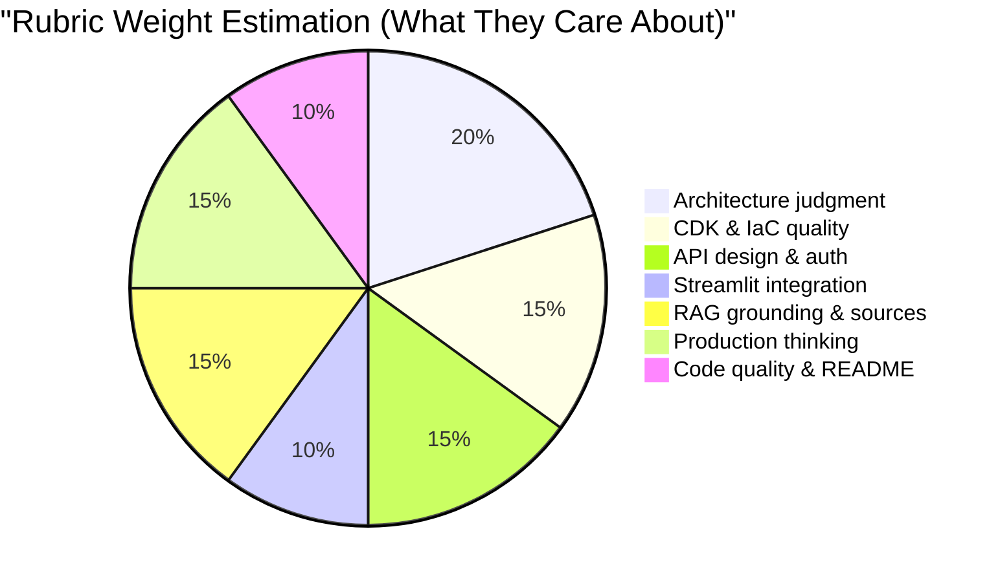

# Project Management: Scope, Prioritization & Decisions

> [!NOTE]
> This document captures scope decisions, prioritization rationale, and risk management for the AWS KB Agent submission.

## 1. Scope Decisions

### 1.1 Document Ingestion: Out of Scope

**Decision**: Document ingestion is **intentionally out of scope** for the submission.

**Rationale**:
1. The brief explicitly states: *"Document ingestion, document management, and user upload workflows are optional extensions and should not be prioritized over the core API, CDK, and Streamlit-to-AWS flow."*
2. A scalable ingestion pipeline (S3 trigger → Lambda → chunk → embed → update index) is a feature in its own right, easily 3-4 hours of work
3. For a "pre-seeded knowledge base" demo, a local seeding script (`scripts/seed.py`) is sufficient and clearly communicates the intent

**What we DO**:
- Include 3 sample documents in `sample_docs/`
- Provide a seeding script that processes docs locally and uploads the FAISS index to S3
- Document what a production ingestion pipeline would look like in the README

**What we DON'T do**:
- No `/ingest` API endpoint
- No S3 event-driven processing
- No document management UI

### 1.2 Agentic Extensions vs Core Quality

**Decision**: Focus on **core RAG quality** first. Agentic extensions are stretch goals.

**Rationale against evaluation rubric**:

- The rubric weighs **infrastructure, API design, and production thinking** heavily (~60%)
- RAG quality matters (15%) but they explicitly say *"not perfect retrieval quality"*
- Agentic workflows (query rewriting, answer validation, citation checking) fall under RAG quality
- **Diminishing returns**: Going from "good RAG" to "excellent RAG" gains ~5% rubric improvement, while the same time spent on CDK quality or production documentation gains ~15%

**Prioritization order**:
1. 🏆 **Core API + CDK + Auth** (rubric: ~50%)
2. 🥈 **Streamlit + Demo evidence** (rubric: ~10%)
3. 🥉 **RAG quality + confidence** (rubric: ~15%)
4. 📝 **README + production thinking** (rubric: ~25%)
5. 🎯 **Agentic extensions** (bonus, only if time allows)

### 1.3 Agentic Extension Candidates (If Time Allows)

| Extension | Effort | Rubric Impact | Priority |
|-----------|:------:|:------------:|:--------:|
| **Fallback response** (low confidence threshold) | 30 min | Medium | 1st |
| **Query rewriting** (LLM reformulates query for better retrieval) | 1 hr | Medium | 2nd |
| **Confidence thresholding** (return "I don't know" below 0.3) | 15 min | Medium | 3rd |
| **Answer validation** (re-check answer against sources) | 1.5 hr | Low | 4th |
| **Conversation memory** (DynamoDB session store) | 2 hr | Low | 5th |

> [!TIP]
> **My recommendation**: Implement the fallback response and confidence thresholding (~45 min total). These are low-hanging fruits that demonstrate "uncertainty handling" — a specific rubric item. Skip the rest unless you finish early.

## 2. Feature Prioritization Matrix

### MoSCoW for Submission

| Priority | Feature | Status |
|----------|---------|:------:|
| **Must Have** | CDK synth + deploy (2 stacks) | ✅ |
| **Must Have** | API Gateway + API Key auth | ✅ |
| **Must Have** | CloudWatch access logs (APIGW) + execution logs (Lambda) | ✅ |
| **Must Have** | Lambda /health + /query endpoints | ✅ |
| **Must Have** | Pre-seeded FAISS from sample docs | ⬜ |
| **Must Have** | Streamlit client calling AWS API | ⬜ |
| **Must Have** | Structured JSON response (answer, sources, confidence, metadata) | ✅ |
| **Must Have** | README with architecture diagram, tradeoffs, demo evidence | ⬜ |
| **Should Have** | Structured CloudWatch logging with request IDs | ✅ |
| **Should Have** | Error handling (401, 400, 500 with structured errors) | ⬜ |
| **Should Have** | `cdk destroy` cleanup instructions | ⬜ |
| **Should Have** | test_api.py validation script | ⬜ |
| **Could Have** | Confidence threshold fallback | ⬜ |
| **Could Have** | Request latency tracking in response | ⬜ |
| **Could Have** | Query rewriting | ⬜ |
| **Won't Have** | Document upload/ingestion endpoint | ❌ |
| **Won't Have** | Cognito auth (documented as future) | ❌ |
| **Won't Have** | CI/CD pipeline | ❌ |
| **Won't Have** | Streaming responses | ❌ |
| **Won't Have** | Multi-environment (dev/prod stages) | ❌ |

## 3. Risk Register

| Risk | Likelihood | Impact | Mitigation |
|------|:----------:|:------:|------------|
| **Lambda cold start with FAISS too slow (>15s)** | Medium | High | Use 1024MB memory. ETag-cache index in `/tmp`. Document Fargate as production alternative |
| **faiss-cpu exceeds Lambda 250MB package limit** | Medium | High | Use Docker-based Lambda (ECR image). CDK supports this natively |
| **Bedrock model access not enabled in sandbox** | Low | Critical | Check model access immediately after getting credentials. Document which models are available |
| **Budget exceeded** | Low | Medium | Use Claude Haiku (cheapest). Destroy resources after testing. Monitor costs |
| **CDK deploy fails due to IAM permissions** | Low | Medium | The brief says IAM permissions are granted. Document what failed and fix |
| **FAISS dimension mismatch** | Certain | Medium | Use consistent 512 dimensions everywhere (Titan Embed v2 configured with `dimensions=512`) |
| **Time overrun** | Medium | Medium | Implement in priority order. MVS checkpoint at 6 hours |
| **ECR images not cleaned by `cdk destroy`** | Certain | Low | ECR repo lives in CDKToolkit bootstrap stack. Manual cleanup: `aws ecr delete-repository --force` |

## 4. Execution Strategy

The implementation follows a sequential subsystem approach within a single conversation thread:

| Phase | Focus | Input | Output |
|-------|-------|-------|--------|
| **Phase 0** | CDK scaffolding + architecture | Design docs | Working `cdk synth` (✅ done) |
| **Phase 1** | Lambda RAG engine | Runtime stubs + prototype code | Working handler (FAISS, Bedrock) (✅ done) |
| **Phase 2.5**| Build Tooling | `uv.lock` + Makefile | Multi-stage caching setup (✅ done) |
| **Phase 3** | Deployment, Seeding & Tests | AWS SSO credentials | Live API + S3 Index |
| **Phase 4** | Streamlit client | API URL + key | Working local UI |
| **Phase 5** | README + evaluation | All of the above | Submission-ready repo |

## 5. Decision Log

| # | Decision | Options Considered | Chosen | Rationale |
|---|----------|-------------------|--------|-----------| 
| 1 | **Architecture** | Lambda, Fargate, Bedrock KB, AgentCore | Lambda + API Gateway | Best budget, fastest impl, maximum rubric explanation surface |
| 2 | **Auth method** | API Key, Lambda Auth, Cognito | API Gateway API Key | Simplest, demo-friendly, clear upgrade path to Cognito |
| 3 | **Vector store** | FAISS in-memory, Pinecone, pgvector | FAISS in Lambda | Recommended by brief, zero cost, simple |
| 4 | **Embedding model** | Gemini, Titan, Cohere | Bedrock Titan Embed v2 (512d) | AWS-native, cheapest, no external API calls |
| 5 | **LLM** | Claude Haiku, Claude Sonnet, Gemini | Claude Haiku 4.5 via Bedrock | Brief recommends Haiku. Cheapest Bedrock model |
| 6 | **Project tool** | pip+venv, poetry, uv | uv | Modern, fast, lock file for reproducibility |
| 7 | **CDK language** | TypeScript, Python | Python | Same language as application code |
| 8 | **Ingestion scope** | Full pipeline, simple endpoint, script-only | Seeding script only | Brief says don't prioritize. Script demonstrates understanding |
| 9 | **Lambda packaging** | Zip, Docker/ECR | Docker/ECR | Required for faiss-cpu OS compatibility |
| 10 | **Prompt format** | Free-text, XML tags | XML tags for Claude | Claude's recommended format for best performance |
| 11 | **CDK stack count** | One stack, separate stacks per component | Two stacks (stateful + stateless) | Stateful/stateless split prevents accidental data deletion; stateless stack is safe to destroy |
| 12 | **API Gateway type** | REST API, HTTP API v2 | REST API | HTTP API v2 lacks native API Key support; REST API matches current auth model |
| 13 | **Bedrock IAM** | Alpha CDK constructs, manual ARN | Manual `add_to_role_policy` | Alpha package introduces unstable API risk and wildcards region; manual is strictly least-privilege |

## 6. Minimum Viable Submission Checkpoint (Hour 6)

At the 6-hour mark, verify you have at minimum:

- [x] CDK that `synth`s successfully (two stacks)
- [ ] Lambda handler code that works locally (uvicorn)
- [ ] Pre-built FAISS index (even if manually built, not scripted)
- [ ] Streamlit client code (even if pointing to mock/local)
- [ ] README skeleton with architecture description

This checkpoint ensures you have **something to submit** even if debugging takes longer than expected.

## 7. What to Document as "Production Improvements"

The rubric explicitly rewards *"clearly separate what is implemented for the take-home from what would be added for a production deployment."*

**Document these as future improvements in README**:

| Category | Current (Demo) | Production |
|----------|---------|------------|
| **Auth** | API Gateway API Key | Cognito + JWT with user pools, MFA |
| **Compute** | Lambda (cold starts) | ECS Fargate with ALB, auto-scaling |
| **Streaming** | Not supported (REST APIGW buffers) | Fargate + ALB (HTTP/2) or Lambda Function URLs + CloudFront |
| **Storage** | FAISS in-memory, S3 for persistence | pgvector on RDS or Pinecone |
| **Ingestion** | Manual seeding script | S3 trigger → Lambda → processing pipeline |
| **Networking** | Public API | VPC + private subnets + NAT Gateway |
| **CI/CD** | Manual `cdk deploy` | CodePipeline + CodeBuild |
| **Observability** | CloudWatch logs + APIGW access logs | X-Ray tracing + CloudWatch dashboards + alarms |
| **Cost controls** | Usage Plan throttling (10 RPS / 20 burst) | AWS Budgets + token usage tracking + monthly quota |
| **Secrets** | CDK-generated API key | Secrets Manager with rotation |
| **Multi-tenancy** | Single tenant | DynamoDB-backed tenant isolation |
| **Stack isolation** | Stateful/stateless split | Enable Termination Protection on stateful, SCPs on prod account |

## 8. Sample Documents Strategy

To populate the `sample_docs/` directory, use the following prompt with an autonomous search agent. The goal is to obtain three high-quality, technically relevant documents that provide a realistic evaluation scenario (mixing deep technical content with high-level business context):

> **Prompt for Search Agent:**
>
> "Act as a technical researcher. I need 3 high-quality PDF documents to serve as the seed corpus for a Knowledge Base / RAG system prototype. Search the web, specifically targeting sources like arXiv, AWS technical blogs, and McKinsey.
>
> Retrieve exactly 3 documents that meet these criteria:
> 1. **RAG Optimization & AI Engineering**: A technical paper (e.g., from arXiv) discussing performance optimizations across the RAG stack. Look for keywords like: profiling retrievers, rerankers, semantic chunking strategies, hybrid search optimization, and practical deployment tips.
> 2. **Embedding Model Evaluations**: A technical evaluation or benchmark paper comparing various embedding models (e.g., Titan, Cohere, OpenAI, Open-source). Look for keywords like: MTEB benchmark, embedding dimensionality, retrieval latency, cosine similarity thresholds, and vector space alignment.
> 3. **Business Context**: A recent (2025 or 2026) AI business report, preferably from McKinsey, Gartner, or BCG. Look for keywords like: enterprise AI adoption, generative AI ROI, business utility of LLMs, and strategic implementation of knowledge bases.
>
> For each document, download the PDF, name it descriptively (e.g., `rag_optimization.pdf`, `embedding_evals.pdf`, `mckinsey_ai_2025.pdf`), and save them in the `sample_docs/` folder. Ensure the files contain selectable text (not scanned images) so they can be parsed by LangChain document loaders."
