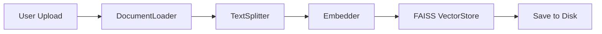
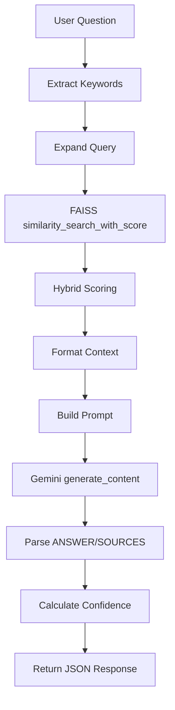

# Prototype Analysis: Knowledge-Base-Agent-using-RAG

!!! note "Prototype Reference"
    This document analyzes the reference prototype at [Knowledge-Base-Agent-using-RAG](file:///c:/Users/daniv/Programacion/Knowledge-Base-Agent-using-RAG) to understand what we're migrating to AWS.

## 1. Repository Structure

The prototype has **two implementations**: a Streamlit-only version (simple) and a FastAPI+Next.js "production" version. Both share the same RAG logic patterns.

```
Knowledge-Base-Agent-using-RAG/
├── app.py                          # Streamlit entrypoint (1364 lines, monolith UI)
├── config.py                       # Shared configuration (API keys, paths, RAG params)
├── requirements.txt                # Streamlit version dependencies
├── loaders/
│   └── document_loader.py          # LangChain document loaders (PDF, DOCX, TXT)
├── rag/
│   ├── embedder.py                 # FAISS vectorstore + Gemini embeddings
│   ├── retriever.py                # Hybrid retrieval (vector + keyword)
│   └── generator.py                # Gemini LLM generation + confidence scoring
├── utils/
│   ├── text_splitter.py            # RecursiveCharacterTextSplitter wrapper
│   └── helpers.py                  # File I/O, logging setup
├── backend/                        # FastAPI "production" version
│   ├── app.py                      # FastAPI entrypoint with CORS, routers
│   ├── core/config.py              # Pydantic BaseSettings (env-driven)
│   ├── api/routes/
│   │   ├── query.py                # POST /api/query/ — RAG query endpoint
│   │   ├── upload.py               # POST /api/upload/ — File upload + processing
│   │   ├── files.py                # GET /api/files/, DELETE /api/files/{id}
│   │   └── health.py               # GET /api/health/
│   ├── rag/
│   │   ├── embedder.py             # Same pattern as root rag/
│   │   ├── retriever.py            # Same pattern as root rag/
│   │   ├── generator.py            # Same pattern, adds confidence_breakdown
│   │   └── processor.py            # Combined load + split (DocumentProcessor)
│   ├── services/
│   │   ├── s3.py                   # AWS S3 upload/download service
│   │   └── mongodb.py              # MongoDB metadata + chat logging
│   └── models/
│       ├── query.py                # Pydantic request/response models
│       └── file.py                 # FileUploadResponse model
└── frontend/                       # Next.js 14 + TypeScript (NOT relevant for us)
```

## 2. RAG Pipeline Deep Dive

### 2.1 Document Ingestion Flow



| Step | File | Key Logic |
|------|------|-----------|
| **Load** | [document_loader.py](file:///c:/Users/daniv/Programacion/Knowledge-Base-Agent-using-RAG/loaders/document_loader.py) | Uses LangChain `PyPDFLoader`, `Docx2txtLoader`, `TextLoader`. Adds `source` and `file_path` metadata |
| **Split** | [text_splitter.py](file:///c:/Users/daniv/Programacion/Knowledge-Base-Agent-using-RAG/utils/text_splitter.py) | `RecursiveCharacterTextSplitter(chunk_size=1000, chunk_overlap=200)`. Separators: `\n\n`, `\n`, `. `, ` `, `""`. Adds `chunk_index` to metadata |
| **Embed** | [embedder.py](file:///c:/Users/daniv/Programacion/Knowledge-Base-Agent-using-RAG/rag/embedder.py) | `GoogleGenerativeAIEmbeddings(model="models/embedding-001")` via LangChain. Creates `FAISS.from_documents()` |
| **Store** | [embedder.py](file:///c:/Users/daniv/Programacion/Knowledge-Base-Agent-using-RAG/rag/embedder.py#L85-L104) | `store.save_local()` → saves `index.faiss` + `index.pkl` to `vectorstore/` dir |

### 2.2 Query / Retrieval Flow



### 2.3 Retrieval Strategy (How they do it)

**File**: [retriever.py](file:///c:/Users/daniv/Programacion/Knowledge-Base-Agent-using-RAG/rag/retriever.py)

1. **Keyword Extraction** (L34-L61): Simple stop-word removal, regex word extraction, dedup
2. **Query Expansion** (L63-L81): Appends keywords to original query string
3. **Over-retrieve then filter** (L150): Retrieves `min(k*3, 20)` candidates
4. **FAISS distance function**: Uses default L2/cosine distance (FAISS returns **distance** scores — **lower is better**)
5. **Hybrid scoring** (L186): `combined_score = 0.7 * similarity_score + 0.3 * keyword_match_score`
6. **Sort by combined score** and take top-k

### 2.4 Confidence Scoring (How they do it)

**File**: [generator.py](file:///c:/Users/daniv/Programacion/Knowledge-Base-Agent-using-RAG/rag/generator.py#L254-L306)

The confidence score is a **heuristic blend** — NOT model-based uncertainty:

```
confidence = 0.5 * best_similarity      (best retrieved chunk similarity)
           + 0.3 * avg_similarity       (average across all retrieved chunks)
           + 0.1 * consistency          (1/(1+variance) of distance scores)
           + 0.1 * keyword_boost        (word overlap between query & docs)
```

Then: `confidence = confidence ** 0.9` (slight sigmoid-like adjustment) and clamped to [0, 1].

!!! important "Confidence Scoring Behavior"
    This confidence score is **NOT** from the LLM. It's purely retrieval-quality based. This is actually a reasonable approach — it measures how well the knowledge base matched the query, not how "certain" the LLM is.

### 2.5 Source Citation Behavior

**File**: [retriever.py](file:///c:/Users/daniv/Programacion/Knowledge-Base-Agent-using-RAG/rag/retriever.py#L230-L261)

- Sources are metadata from retrieved chunks: `source` (filename), `chunk_index`, `file_path`, `content_preview` (first 300 chars)
- The LLM prompt asks for `SOURCES:` at the end, but the actual source list returned to the user comes from the **retriever metadata**, not the LLM output
- The LLM output `SOURCES:` section is parsed but the real sources come from `get_source_metadata()`

### 2.6 Prompting Strategy

**File**: [generator.py](file:///c:/Users/daniv/Programacion/Knowledge-Base-Agent-using-RAG/rag/generator.py#L27-L73)

- **No prompt caching**: Fresh prompt every query
- **No query rewriting**: The retriever does keyword expansion, but no LLM-based rewriting
- **No Chain-of-Thought**: The prompt uses step-by-step instructions (FIRST, SECOND, THIRD, FOURTH) but this is instruction formatting, not CoT reasoning
- **Grounding constraint**: Strict "ONLY from context" instruction with fallback message
- **Temperature**: 0.7 (quite high for a grounded QA task — we should use lower)
- **Max tokens**: 1000

### 2.7 LLM Provider

- Uses **Google Gemini** exclusively (not AWS Bedrock)
- Embedding model: `models/embedding-001` (Google)
- LLM: Auto-detects latest Gemini model, prefers `gemini-pro` or `gemini-1.5-flash`
- **For AWS migration**: We replace with Amazon Bedrock (Claude 3 Haiku for budget)

## 3. Streamlit App Entry Point

**File**: [app.py](file:///c:/Users/daniv/Programacion/Knowledge-Base-Agent-using-RAG/app.py) (1364 lines — monolith)

The Streamlit app is a **monolithic file** that handles:
- Custom CSS theming (dark mode)
- Sidebar: file upload, knowledge base management, file listing
- Main area: chat interface with question input, answer display
- Session state management for chat history, vectorstore state
- Direct calls to `DocumentLoader`, `TextSplitter`, `Embedder`, `Retriever`, `Generator`

**Key concern**: 1364 lines in one file, tightly coupled to Streamlit session state. Our new Streamlit client will be **thin** — just API calls to the AWS backend.

## 4. Backend (FastAPI) Entry Point

**File**: [backend/app.py](file:///c:/Users/daniv/Programacion/Knowledge-Base-Agent-using-RAG/backend/app.py)

- FastAPI with CORS, TrustedHostMiddleware
- Routes: `/api/health/`, `/api/upload/`, `/api/query/`, `/api/files/`
- Uses lazy-loaded global singletons for `Embedder`, `Retriever`, `Generator`
- **MongoDB dependency**: [query.py](file:///c:/Users/daniv/Programacion/Knowledge-Base-Agent-using-RAG/backend/api/routes/query.py#L75-L81) logs every query to MongoDB — we will **replace this** with CloudWatch structured logs

## 5. What We Keep vs What We Replace

| Component | Prototype | Our AWS Version |
|-----------|-----------|-----------------|
| **Embedding model** | Google `embedding-001` | Amazon Bedrock Titan Embeddings (or keep Gemini if cheaper) |
| **LLM** | Google Gemini | Amazon Bedrock Claude 4.5 Haiku ($0.25/M input tokens) |
| **Vector store** | FAISS (local disk) | FAISS in-memory on Lambda/ECS (recommended by brief) |
| **Document storage** | Local `data/` dir | Amazon S3 |
| **Metadata store** | MongoDB | DynamoDB (optional) or none |
| **API framework** | FastAPI | FastAPI on Lambda (via Mangum) or ECS/Fargate |
| **Auth** | None | API Gateway + API Key or Cognito |
| **Frontend** | Streamlit monolith (1364 lines) | Thin Streamlit client (~100 lines, API calls only) |
| **IaC** | None | AWS CDK (Python) |
| **Observability** | `logging.basicConfig()` | CloudWatch Logs + structured JSON |
| **Chunking** | RecursiveCharacterTextSplitter | Same (proven pattern, keep it) |
| **Retrieval** | Hybrid FAISS + keyword | Same pattern, swap embedding model |
| **Confidence** | Heuristic blend | Same pattern (it's reasonable) |

## 6. Running the Prototype Locally (Step-by-Step)

### 6.1 Streamlit Version

```bash
cd c:\Users\daniv\Programacion\Knowledge-Base-Agent-using-RAG

# Create venv (or use uv)
uv venv
source .venv/bin/activate  # or .venv\Scripts\activate on Windows

# Install deps
uv pip install -r requirements.txt

# Set API key
export GEMINI_API_KEY="your-key-here"  # or create .env file

# Run
streamlit run app.py
# Opens at http://localhost:8501
```

### 6.2 FastAPI Backend Version

```bash
cd backend/
uv pip install -r requirements.txt
# Create backend/.env with GEMINI_API_KEY=...
uvicorn app:app --reload --host 127.0.0.1 --port 8000
# API docs at http://127.0.0.1:8000/docs
```

!!! warning "Graceful Degradation"
    The backend depends on MongoDB and S3 services that gracefully degrade if unconfigured. Without MongoDB, query logging is silently skipped. Without S3, files save locally. This means **the backend should work with just `GEMINI_API_KEY`** for basic testing.

## 7. Key Observations

1. **The RAG pipeline is well-structured** — clean separation of Loader → Splitter → Embedder → Retriever → Generator
2. **The confidence scoring is heuristic-based** (retrieval quality, not LLM confidence) — this is actually a **good approach** and we should keep it
3. **No authentication at all** — the FastAPI backend has no auth middleware
4. **Stateful FAISS** — vectorstore lives on local disk. For Lambda this means either: (a) bundle it in the deployment package, (b) load from S3 at cold start, or (c) use ECS with persistent storage
5. **The "production" backend is partially built** — it has FastAPI routes, Pydantic models, S3 service, but no actual deployment (no IaC, no containerization for AWS)
6. **Google-specific throughout** — every LLM/embedding call goes through Google APIs. Complete provider swap needed
