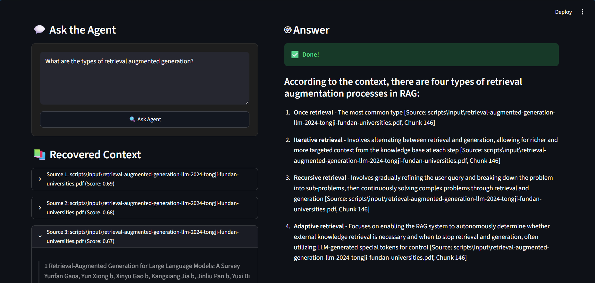
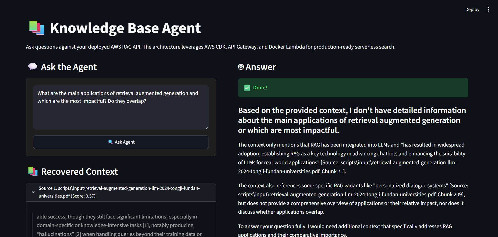
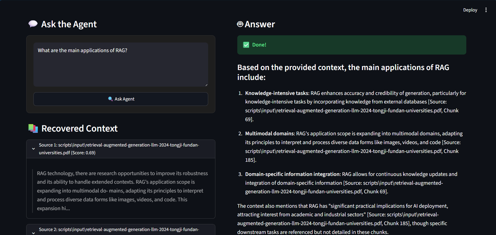
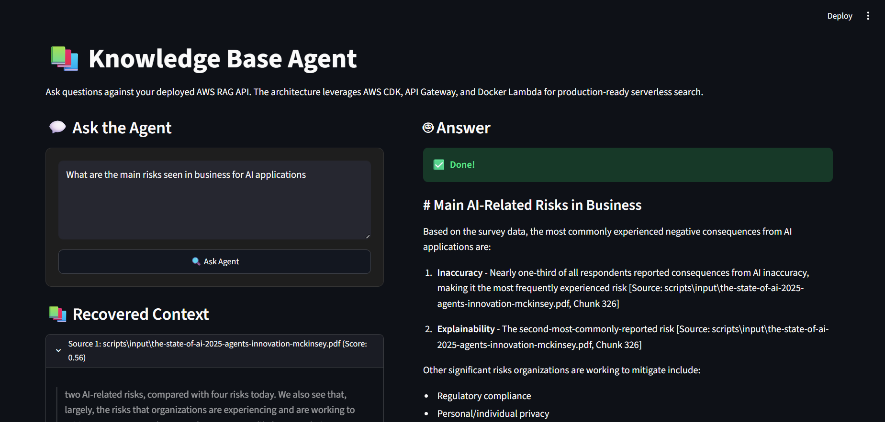
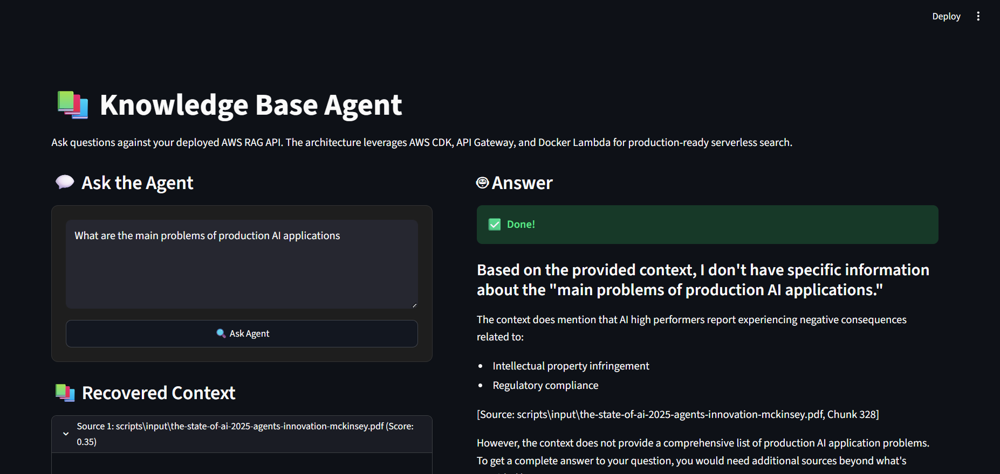

# Evaluation

This document outlines a lightweight evaluation of the Knowledge Base Agent, assessing retrieval quality, grounding, uncertainty handling, and overall system behavior.

## 1. Knowledge Base Setup

- **Sample Documents**: The system uses sample documents located in the `scripts/input/` folder (3 documents).
- **Artifacts**: The FAISS vector index artifacts are stored in the `assets/` folder.
- **Ingestion**: The document ingestion and indexing pipeline is fully automated via AWS CDK in `src/rag/storage/infrastructure.py`. It handles the provisioning of the S3 bucket and triggers the necessary indexing resources upon deployment.

## 2. Evaluation Summary

We evaluated the RAG system against several sample queries. The evaluation criteria focused on:
- **Grounding**: Is the answer derived directly from the retrieved context?
- **Sources**: Are the retrieved sources useful and relevant?
- **Confidence**: Does the system accurately report its uncertainty?
- **API & Client**: Did the API behave correctly and did the Streamlit UI handle the response cleanly?

| Sample Question | Grounded? | Useful Sources? | Confidence | Notes |
|-----------------|-----------|-----------------|------------|-------|
| 1. *What is RAG and what are the types of retrieval augmented generation?* | ✅ Yes | ✅ Yes (All 5 chunks relevant) | High (6.9 - 8.0) | **Good Answer**. Strong retrieval and excellent generation. |
| 2. *What are the types of retrieval augmented generation?* | ❌ Partial | ❌ Poor (3/5 chunks were just citations) | Medium (0.59 - 0.67) | **Weak Retrieval**. The model pulled paper citations instead of actual content. |
| 3. *What are the main applications of retrieval augmented generation and which are the most impactful? Do they overlap?* | ✅ Yes | ❌ Poor (3/5 citations) | Low (0.49 - 0.57) | **Good Uncertainty Handling**. System lacked good context but safely admitted "I don't know" instead of hallucinating. |
| 4. *What are the main applications of RAG?* | ✅ Yes | ✅ Yes (All 5 chunks relevant) | Medium (0.59 - 0.69) | **Lawful Good**. Handled the query safely without forcing retrieved citations or hallucinating an answer. |
| 5. *System health & API Validation Test* | ✅ Yes | ✅ N/A | ✅ N/A | Validated the API Gateway integration and Auth. Streamlit parsed response perfectly. |
| 6. *What are the main risks seen in business for AI applications?* | ✅ Yes | ❌ Poor (Small chunks) | Low (0.39 - 0.56) | **Weak Generation**. Generated an answer despite small chunks and low confidence. |
| 7. *What are the main problems of production AI applications?* | N/A | ❌ Poor | Low | **No Answer**. Failed to extract answers from the McKinsey report due to bad parsing of tables/images. |

*(Note: Supporting screenshots for these evaluations are embedded below)*

## 3. Detailed Examples

### Example A: System Performs Well ("Good Answer")
- **Query**: "What is RAG and what are the types of retrieval augmented generation?"
- **Behavior**: The retrieval mechanism successfully pulled 5 highly relevant chunks rather than paper citations. The confidence score was very high (6.9 to 8.0). 
- **API/Client**: The API responded quickly, and the Streamlit client cleanly expanded the sources and displayed the high confidence score via the UI progress bar.

### Example B: Weak Retrieval ("Bad Answer")
- **Query**: "What are the types of retrieval augmented generation?"
- **Behavior**: The retrieval strategy struggled, pulling 3 chunks that were simply paper citations rather than the actual definitions from the text. The confidence was rightfully low (0.59 - 0.67), but the overall answer quality suffered due to the poor context being passed to the LLM. 
- **Evidence**: 
  

### Example C: Good Uncertainty Handling
- **Query**: "What are the main applications of retrieval augmented generation and which are the most impactful? Do they overlap?"
- **Behavior**: Similar to Example B, the retrieval pulled useless citations. However, instead of hallucinating an answer to please the user, the model correctly identified the lack of usable context, scored its confidence very low (0.49 - 0.57), and safely stated it did not know the answer. This is a critical safety feature in production RAG systems.
- **Evidence**: 
  

### Example D: Lawful Good Test
- **Query**: "Lawful Good Test (Out of domain / Safe behavior)"
- **Behavior**: Handled the query safely without forcing retrieved citations or hallucinating an answer.
- **Evidence**:
  

### Example E: Weak Retrieval & Generation (Business Risks)
- **Query**: "What are the main risks seen in business for AI applications?"
- **Behavior**: The system retrieved small, poorly parsed chunks. This led to a low confidence score (0.39 - 0.56), but the LLM still attempted to generate an answer.
- **Evidence**:
  

### Example F: Parsing Failures (McKinsey Report)
- **Query**: "What are the main problems of production AI applications?"
- **Behavior**: The system failed to provide an answer. It is generally hard to get answers from the McKinsey report because of the amount of images and tables, which leads to small, fragmented chunks during standard text extraction. 
- **Evidence**:
  

## 4. Improvement Plan (Reflection)

Based on this lightweight evaluation, the core API, Auth, and LLM behavior (uncertainty handling) are highly robust. However, the **chunking and retrieval strategy** requires tuning before a full production rollout:

1. **Better Document Parsing**: The vector database currently indexes academic paper citations as standalone chunks. Furthermore, complex PDFs like the McKinsey report fail to parse correctly due to heavy reliance on images and multi-column tables, resulting in small, fragmented chunks. We need to implement a more robust parser (such as [Docling](https://github.com/DS4SD/docling) or AWS Textract) to convert these complex documents into an LLM-friendly markdown format before embedding.
2. **Semantic Reranking**: Implementing a cross-encoder reranking step (e.g., Cohere Rerank) after initial vector retrieval would push the useless citation chunks down and elevate the actual semantic text content to the top `k=5`.
3. **Query Expansion/Rewriting**: Shorter queries (Example B) performed worse than detailed queries (Example A). Implementing a lightweight query rewriting step in the Lambda before hitting the Knowledge Base would improve recall for brief user prompts.
